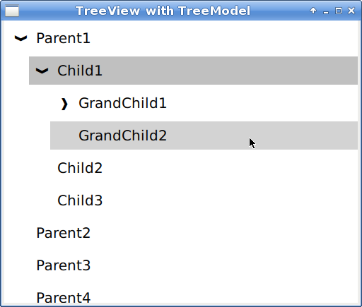
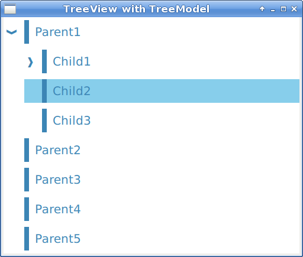
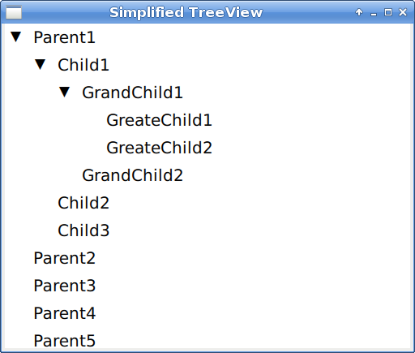
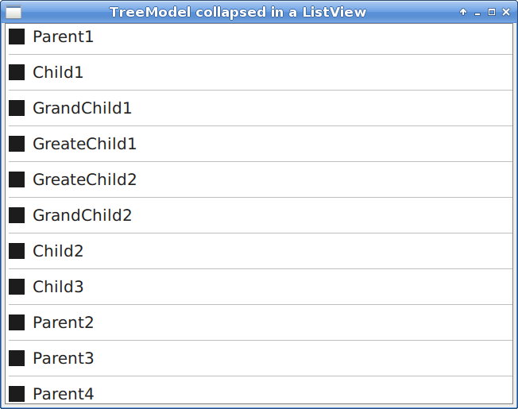

# QMLTreeView

This project show different demo implementing a QML Tree View with a C++ Tree Model for Qt 5.15 and QuickControls 2.


## Usage

Expose and populate the TreeModel from C++, then just initialize it 

```
    TreeView {
        anchors.fill: parent
        model: treeModel

        selectionEnable: true
        hoverEnabled: true
    }
```
and this is the result



Color styling can be customize as follow:

```
    TreeView {
        anchors.fill: parent
        model: treeModel

        selectionEnable: true
        hoverEnabled: true

        color: "steelblue"
        hoverColor: "skyblue"
        selectedColor: "dodgerblue"
        selectedItemColor: "white"
        indicatorStyle: TreeView.Indicator.Chevron
    }
```
giving




## C++


```
int main()
{
   auto parent1 = new TreeItem("Parent1");
   auto parent2 = new TreeItem("Parent2");
   auto child1 = new TreeItem("Child1");
   auto grandChild1 = new TreeItem("GrandChild1");
   
   auto treeModel = new TreeModel();
   auto root = treeModel->rootItem().get();
   treeModel->addItem(root, parent1);
   treeModel->addItem(root, parent2);
   treeModel->addItem(parent1, child1);
   treeModel->addItem(child1, grandChild1);
   treeModel->addItem(child1, grandChild2);
   
   QQmlApplicationEngine engine;
   engine.rootContext()->setContextProperty("treeModel", treeModel);
   engine.load(url);

   return app.exec();
}

```

# Samples


## TreeView

This sample provides the following features:
- Item selection
- Item hover
- Color customization


## Simplified

This sample show the minimal code to build the TreeView. No features are implemented here.




## ListView

Since the TreeModel actually is flattened to one column, can be basically used as a ListView




## Credits


[QmlTreeViewExample](https://github.com/Palm1r/QmlTreeViewExample)
