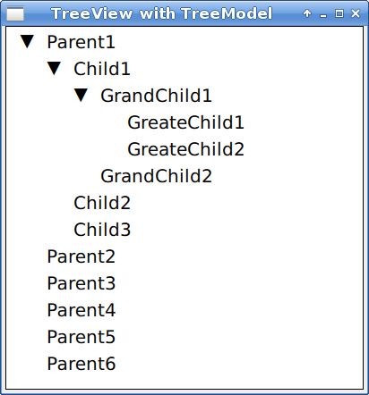
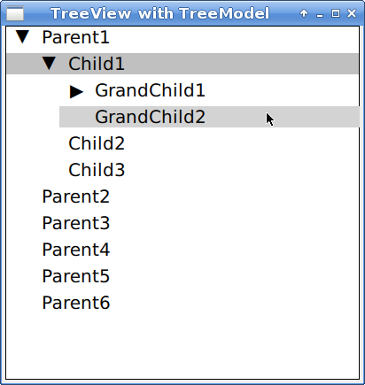
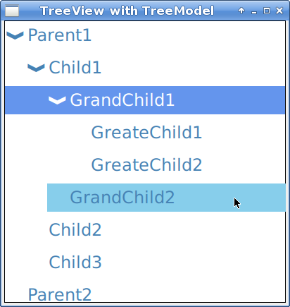

# QMLTreeView

This project provides a QML Tree View with a C++ Tree Model for Qt 5.15 and QuickControls 2.
the project is still in beta, so breaking change can happen and backward compatibility is still not guaranteed.

## Features
 - QML Tree View
 - C++ Tree Model
 - Item selection
 - Item hovering
 - Customizable layout (color, font, positioning)
 - Delegates to fully customize part of the TreeView


# Usage

## C++


```
int main()
{
   auto parent1 = new TreeItem("Parent1");
   auto parent2 = new TreeItem("Parent2");
   auto child1 = new TreeItem("Child1");
   auto grandChild1 = new TreeItem("GrandChild1");
   
   auto treeModel = new TreeModel();
   auto root = treeModel->rootItem().get();
   treeModel->addItem(root, parent1);
   treeModel->addItem(root, parent2);
   treeModel->addItem(parent1, child1);
   treeModel->addItem(child1, grandChild1);
   treeModel->addItem(child1, grandChild2);
   
   QQmlApplicationEngine engine;
   engine.rootContext()->setContextProperty("treeModel", treeModel);
   engine.load(url);

   return app.exec();
}

## QML


Expose and populate the TreeModel from C++, then just initialize it 

```
    TreeView {
        anchors.fill: parent
        model: treeModel
    }
```
and this is the result




# Platforms


Code has been tested in the following OS:

- Windows
- Linux

# Customization

## Selection / Hovering

Hovering and selection can be activated enabling the respective properties
```
    TreeView {
        anchors.fill: parent
        model: treeModel
        
        selectionEnable: true
        hoverEnabled: true
    }
```



## Styling

TreeView support color styling for each part. Positioning can be customized with the properties rowHeight, rowPadding and rowSpacing.

```
    TreeView {
        anchors.fill: parent
        model: treeModel

        selectionEnable: true
        hoverEnabled: true

        color: "steelblue"
        handleColor: "steelblue"
        hoverColor: "skyblue"
        selectedColor: "cornflowerblue"
        selectedItemColor: "white"
        
        handleStyle: TreeView.Handle.Chevron
        rowHeight: 30
        rowPadding: 30 
        font.pixelSize: 24
    }
```



Font can be customized through properties font and fontMetrics.

The default handle comes with differents default styles:

```
    enum Handle {
        Triangle,
        TriangleSmall,
        TriangleOutline,
        TriangleSmallOutline,
        Chevron,
        Arrow
    }
```

## Custom Delegates

These component are provided and can be customized with delegates:
- contentItem: the control element of each row
- handle: element to collapse/expand the TreeView
- highlight: the highlight element

Each delegate can use the property currentRow to retreive the information for its own row.
currentRow possess the following properties:
- currentIndex
- currentData
- currentItem
- itemChildCount
- expanded
- selected
- hasChildren
- isSelectedIndex
- isHoveredIndex
- isSelectedAndHoveredIndex

currentRow.toggle() toggle the expansion of the current section.

```
TreeView {
    id: delegateTreeView
    anchors.fill: parent
    anchors.margins: 1

    model: treeModel
    selectionEnabled: true

    contentItem: Row {
        spacing: 10

        Rectangle {
            width: parent.height * 0.6
            height: width
            radius: width
            y: width / 3
            color: currentRow.hasChildren ? "tomato" : "lightcoral"
        }

        Text {
            verticalAlignment: Text.AlignVCenter

            color: currentRow.isSelectedIndex ? delegateTreeView.selectedItemColor : delegateTreeView.color
            text: currentRow.currentData
            font: delegateTreeView.font
        }
    }

    handle: Item {
        width: 20
        height: 20
        Rectangle {
            anchors.centerIn: parent
            width: 10
            height: 2
            color: "black"
            visible: currentRow.hasChildren

            Rectangle {
                anchors.centerIn: parent
                width: parent.height
                height: parent.width
                color: parent.color
                visible: parent.visible && !currentRow.expanded
            }
        }
    }

    highlight: Item {
        Rectangle {
            color: "pink"
            width: parent.width * 0.9
            height: parent.height
            anchors.left: parent.left
            radius: 20
        }
        Rectangle {
            color: "pink"
            width: parent.width * 0.2
            height: parent.height
            anchors.right: parent.right
            radius: 20
        }
        
        Behavior on y { NumberAnimation { duration: 150 }}
    }
}
```

## Data Access

Data access for row element is provided by the properties:
- currentIndex: return the model index for the selected element
- currentData: return the data for the selected element
- currentItem: return the visual item of the selected element

## Credits

[QmlTreeViewExample](https://github.com/Palm1r/QmlTreeViewExample)
