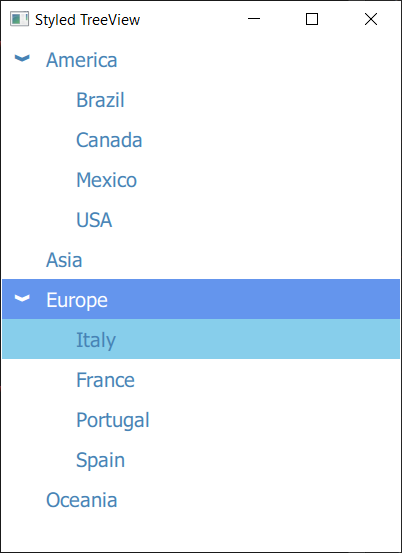

# QMLTreeView for Qt 5

This project provides a **QML Tree View** with a **C++ Tree Model** for **Qt 5.15** and **QuickControls 2**.

Since **Qt 6.3** [TreeView](https://doc.qt.io/qt-6/qml-qtquick-treeview.html) has been added as standard component.
It is suggested to use the standard one.

## Features
 - QML Tree View
 - C++ Tree Model
 - Item selection
 - Item hovering
 - Customizable layout (color, font, positioning)
 - Delegates to fully customize part of the TreeView
 - A Json Tree View implementation


# Usage

## C++


```
int main()
{
   auto america = new TreeItem("America");
   auto asia = new TreeItem("Asia");
   auto europe = new TreeItem("Europe");  
   auto brazil = new TreeItem("Brazil");
   auto canada = new TreeItem("Canada");
   auto italy = new TreeItem("Italy");
   auto portugal = new TreeItem("Portugal");

   auto treeModel = new TreeModel();
   model.addTopLevelItem(america);
   model.addTopLevelItem(asia);
   model.addTopLevelItem(europe);
   model.addItem(america, brazil);
   model.addItem(america, canada);
   model.addItem(europe, italy);
   model.addItem(europe, portugal);

   QQmlApplicationEngine engine;
   engine.rootContext()->setContextProperty("treeModel", treeModel);
   engine.load(url);

   return app.exec();
}
```

## QML


Expose and populate the TreeModel from C++, then just initialize it 

```
    TreeView {
        anchors.fill: parent
        model: treeModel
    }
```
and this is the result


# Platforms


Code has been tested in the following OS:

- Windows
- Linux

# Installation

- Copy the ```modules``` folder to your project, then add the ```qmltreeview.pri``` file or manually add headers, source and
resource file. 
- Add the modules path to the ```QML_IMPORT_PATH```.
- In the main file add the import path to the engine with ```engine.addImportPath("qrc:/modules");```
- In the QML file you can include the module with ```import QMLTreeView 1.0```

# Customization

## Selection / Hovering

Hovering and selection can be activated enabling the respective properties
```
    TreeView {
        anchors.fill: parent
        model: treeModel
        
        selectionEnabled: true
        hoverEnabled: true
    }
```


## Styling

TreeView support color styling for each part. Positioning can be customized with the properties ```rowHeight```, ```rowPadding``` and ```rowSpacing```.

```
    TreeView {
        anchors.fill: parent
        model: treeModel

        selectionEnabled: true
        hoverEnabled: true

        color: "steelblue"
        handleColor: "steelblue"
        hoverColor: "skyblue"
        selectedColor: "cornflowerblue"
        selectedItemColor: "white"
        
        handleStyle: TreeView.Handle.Chevron
        rowHeight: 30
        rowPadding: 30 
        font.pixelSize: 24
    }
```



Font can be customized through properties ```font``` and ```fontMetrics```.

The default handle comes with differents default styles:

```
    enum Handle {
        Triangle,
        TriangleSmall,
        TriangleOutline,
        TriangleSmallOutline,
        Chevron,
        Arrow
    }
```

## Custom Delegates

These component are provided and can be customized with delegates:
- ```contentItem```: the control element of each row
- ```handle```: element to collapse/expand the TreeView
- ```highlight```: the highlight element

Each delegate can use the property ```currentRow``` to retreive the information for its own row.
currentRow possess the following properties:
- ```currentIndex```
- ```currentData```
- ```currentItem```
- ```itemChildCount```
- ```expanded```
- ```selected```
- ```hasChildren```
- ```isSelectedIndex```
- ```isHoveredIndex```
- ```isSelectedAndHoveredIndex```

```currentRow.toggle()``` toggles the expansion of the current section.

```
TreeView {
    id: delegateTreeView
    anchors.fill: parent
    anchors.margins: 1

    model: treeModel
    selectionEnabled: true

    contentItem: Row {
        spacing: 10

        Rectangle {
            width: parent.height * 0.6
            height: width
            radius: width
            y: width / 3
            color: currentRow.hasChildren ? "tomato" : "lightcoral"
        }

        Text {
            verticalAlignment: Text.AlignVCenter

            color: currentRow.isSelectedIndex ? delegateTreeView.selectedItemColor : delegateTreeView.color
            text: currentRow.currentData
            font: delegateTreeView.font
        }
    }

    handle: Item {
        width: 20
        height: 20
        Rectangle {
            anchors.centerIn: parent
            width: 10
            height: 2
            color: "black"
            visible: currentRow.hasChildren

            Rectangle {
                anchors.centerIn: parent
                width: parent.height
                height: parent.width
                color: parent.color
                visible: parent.visible && !currentRow.expanded
            }
        }
    }

    highlight: Item {
        Rectangle {
            color: "pink"
            width: parent.width * 0.9
            height: parent.height
            anchors.left: parent.left
            radius: 20
        }
        Rectangle {
            color: "pink"
            width: parent.width * 0.2
            height: parent.height
            anchors.right: parent.right
            radius: 20
        }
        
        Behavior on y { NumberAnimation { duration: 150 }}
    }
}
```


## Data Access

Data access for row element is provided by the properties:
- ```currentIndex```: return the model index for the selected element
- ```currentData```: return the data for the selected element
- ```currentItem```: return the visual item of the selected element

## Node Manipulation

```TreeModel``` provides the methods ```addTopLevelItem,``` ```addItem```, ```removeItem``` and ```clear``` to add and remove node to the tree. ```setData``` instead provides a way to change the data of a given node.
Take a look at the **Manipulator Example** which show a way to manipulate the tree directly from QML.


## Customizing Models

Since the tree item store a ```QVariant``` as data, it's possible to register your custom type with ```Q_DECLARE_METATYPE``` and use the ```TreeModel``` as is without modifying it.

**JsonTreeView** example show how to achieve that, declaring a ```JsonEntry``` class and providing it to the model.

```
{
   "firstName": "John",
   "lastName": "Smith",
   "age": 25,
   "address": {
      "streetAddress": "21 2nd Street",
      "city": "New York",
      "state": "NY",
      "postalCode": "10021",
      "owner": true
   },
   "phoneNumber": [
      {
        "type": "home",
        "number": "212 555-1234"
      },
      {
        "type": "fax",
        "number": "646 555-4567"
      }
   ]
}
```

main.qml

```
TreeView {
   id: jsonView
   
   anchors.fill: parent
   anchors.margins: 1
   
   model: jsonModel
   rowPadding: 20
   selectionEnabled: true
   
   contentItem: RowLayout {
      Text {
         verticalAlignment: Text.AlignVCenter
         horizontalAlignment: Text.AlignLeft
         text: currentRow.currentData.key
      }
      
      Text {
         Layout.fillWidth: true
         Layout.rightMargin: 10
         
         verticalAlignment: Text.AlignVCenter
         horizontalAlignment: Text.AlignRight
         text: currentRow.currentData.value ? currentRow.currentData.value : ""
      }
   }
}
```


